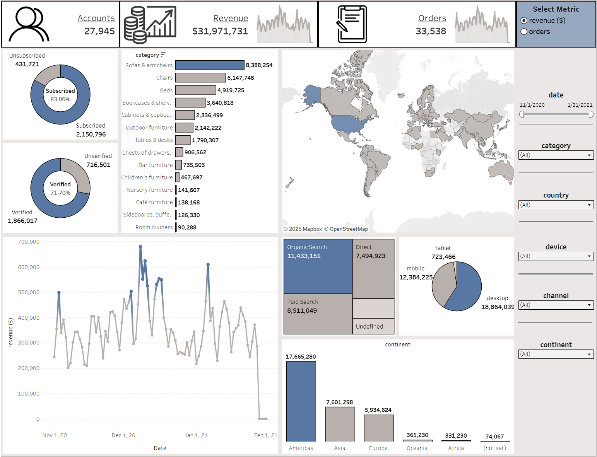

# Furniture Store Data Analysis
**Portfolio project:** analyzing sales performance and user behavior of an online furniture store using SQL, Python, and Tableau. The project includes data extraction from Google BigQuery, exploratory and statistical analysis in Python and interactive visualization in Tableau Public.

---

## Project Objective
The goal of this project is to analyze the sales performance and user behavior of an online furniture store. The analysis explores **sales dynamics**, **top-performing products and categories** and **traffic sources** across continents, countries and device types. Additionally, the project includes **statistical tests and correlation analysis** to understand relationships.

---

## Tools & Technologies
To complete this project, the following tools and technologies were used:
- **SQL (Google BigQuery)** – creating an SQL query in BigQuery to combine multiple tables and build the analytical dataset containing all necessary data;
- **Python** – used to connect to Google BigQuery and execute the created SQL query to load the analytical dataset directly into the notebook. Performed exploratory and statistical data analysis using the following main libraries:
  - **Pandas**, **NumPy** – data cleaning, transformation and aggregation
  - **Matplotlib**, **Seaborn** – data visualization
  - **Plotly Express** – interactive charts *(⚠️ not displayed on GitHub; open in Google Colab to view them)*
  - **SciPy**, **StatsModels** – statistical analysis of relationships and differences between groups (`Shapiro–Wilk`, `Spearman correlation`, `Mann–Whitney U`, `Kruskal–Wallis`, and `Z-test for proportions`)
- **Google Colab** – environment for code execution and data analysis;
- **Tableau Public** – dashboard creation for visualizing analytical results.

---

## Notebook Structure

**File:** `furniture_store_analysis.ipynb`

The Google Colab notebook is organized into the following main sections:
1. **Data visualizations in Tableau** – includes a link to the Tableau Public dashboard and its description.
2. **Connecting to the Database and SQL Query** – connection to Google BigQuery and execution of the SQL query to create the analytical dataset.
3. **Data Overview** – dataset structure, data types, missing values, duplicates and key metrics.
4. **Data Analysis and Visualization** – descriptive statistics and visualizations of sales performance, account activity and sales dynamics.
5. **Pivot Tables** – building pivot tables.
6. **Statistical Analysis of Relationships** – correlation tests between revenue and sessions, continents, categories, countries, channels and devices.
7. **Statistical Analysis of Differences Between Groups** – comparison of daily sales between registered and unregistered users, session counts across traffic channels, and the share of organic sessions between Europe and the Americas.
8. **Conclusions and Recommendations** – final results and practical recommendations.

---

## Dashboard Preview

**Visualization tool:** Tableau Public

*Preview:*  
  

**[View interactive dashboard in Tableau Public](https://public.tableau.com/views/RevenueOrdersDashboard/RevenueOrdersDashboard?:language=en-US&:sid=&:redirect=auth&:display_count=n&:origin=viz_share_link)**

---

## Author

**Sviatoslav Mykytyn**  
📅 November 2025  
💼 Data Analytics Portfolio  
🔗 [LinkedIn](https://www.linkedin.com/in/sviatoslav-mykytyn-758997242/)
